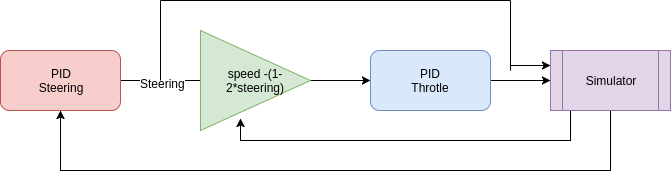

# CarND-PID controller project

## Description
In this project, PID controllers for the steering and gas of a vehicle were implemented, and tested on the Udacity vehicle simulator.

The PID controller was implemented within the PID class object. Then, two PID controller were created using the same class, where only the parameters (Kp, Ki, Kd), and the inputs differed. The output for the vehicle controls is obtained by calling the "Control" function.

The tuning for each controller was done in two steps. First, an automatic tuning algorithm was used. This function is also within the PID class, named as "Tuning". The front-end of the Tuning function is almost exactly as the Controls one, as they both output the control signal for the vehicle. However, the Tuning function implements a simple Twiddle algorithm. 
In the first tuning step, some preliminary gain values are obtained. Since the Twiddle algorithm is slow, after acceptable values are obstained, a final manual tuning was made. 

The human perspective also influences the type of gains wanted. In this project, I present two set of gains: **comfort**, and **sports**  mode"". As you may wonder, the in the sports mode, the car goes faster, and it brakes later in the curves. Comfort mode is much more conservative. Videos of the simulations are shown below.

[Youtube link to the comfort mode simulation](https://youtu.be/9d7J8sOaryk)

[Youtube link to the sports mode simulation](https://youtu.be/XjY3zDpkGr0)

Another thing that influences the way the car drives is how the inputs (or error) is computed. The CTE (cross-track error) is provided by the simulator, although, we don't know how it is actually computed. Is this CTE computed from the geometrical center of the car? 
Because this project also uses a PID controller for the gas, the input used in this project is proportional to the steering control signal, that comes from the first PID controller. When driving, the smaller the curve radius is (curvature), the slower you should drive to avoid oversteering. So, a simple mathematical relationship between the absolute value of the steering and the error for the gas controller was made. The setpoint value for the gas controller was set to the maximum, although the car only top to 75 mph in the straigh segments. A diagram of both PID controllers can be seen below.



## Tuning and influence of each parameter in the perfomance of the controller
### a) Proportional:

This is the most important parameter in the PID controller. The steering or gas will react inmediatly and directly proportionally to the deviation from the setpoint. When you start tuning the PID controller, you should start with this one, while setting the others to zero.

### b) Integral:

Most of the PID controllers used in general are just PI controllers. The integral component is necessary (but not sufficient) to accomplish a theoretical zero error. For our project, since the integral component is the summation of the past errors, the longer the car stays aways from the path's center, the higher the steering angle. However, if this value is too high, the behavior can be oscillatory.

### c) Derivative:

As mentioned earlier, most PID controllers are just PI. The derivative component allows the system to react faster to sudden changes. However, the derivative component also amplifies noise, which is why this component is now always used. As you may see in the code, the derivative component is very small. High values produce an oscillatory response.


---

## Dependencies

* cmake >= 3.5
 * All OSes: [click here for installation instructions](https://cmake.org/install/)
* make >= 4.1(mac, linux), 3.81(Windows)
  * Linux: make is installed by default on most Linux distros
  * Mac: [install Xcode command line tools to get make](https://developer.apple.com/xcode/features/)
  * Windows: [Click here for installation instructions](http://gnuwin32.sourceforge.net/packages/make.htm)
* gcc/g++ >= 5.4
  * Linux: gcc / g++ is installed by default on most Linux distros
  * Mac: same deal as make - [install Xcode command line tools]((https://developer.apple.com/xcode/features/)
  * Windows: recommend using [MinGW](http://www.mingw.org/)
* [uWebSockets](https://github.com/uWebSockets/uWebSockets)
  * Run either `./install-mac.sh` or `./install-ubuntu.sh`.
  * If you install from source, checkout to commit `e94b6e1`, i.e.
    ```
    git clone https://github.com/uWebSockets/uWebSockets 
    cd uWebSockets
    git checkout e94b6e1
    ```
    Some function signatures have changed in v0.14.x. See [this PR](https://github.com/udacity/CarND-MPC-Project/pull/3) for more details.
* Simulator. You can download these from the [project intro page](https://github.com/udacity/self-driving-car-sim/releases) in the classroom.

There's an experimental patch for windows in this [PR](https://github.com/udacity/CarND-PID-Control-Project/pull/3)

## Basic Build Instructions

1. Clone this repo.
2. Make a build directory: `mkdir build && cd build`
3. Compile: `cmake .. && make`
4. Run it: `./pid`. 

Tips for setting up your environment can be found [here](https://classroom.udacity.com/nanodegrees/nd013/parts/40f38239-66b6-46ec-ae68-03afd8a601c8/modules/0949fca6-b379-42af-a919-ee50aa304e6a/lessons/f758c44c-5e40-4e01-93b5-1a82aa4e044f/concepts/23d376c7-0195-4276-bdf0-e02f1f3c665d)


